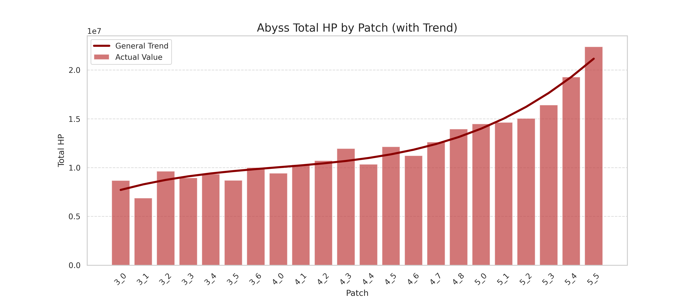
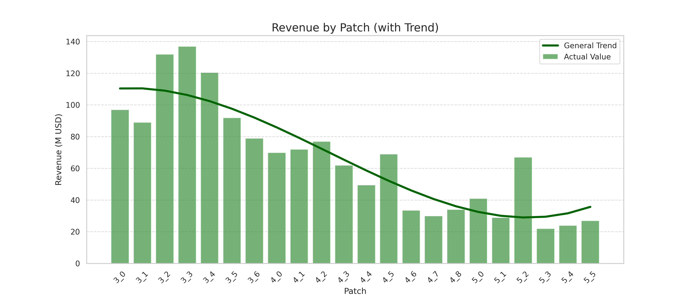
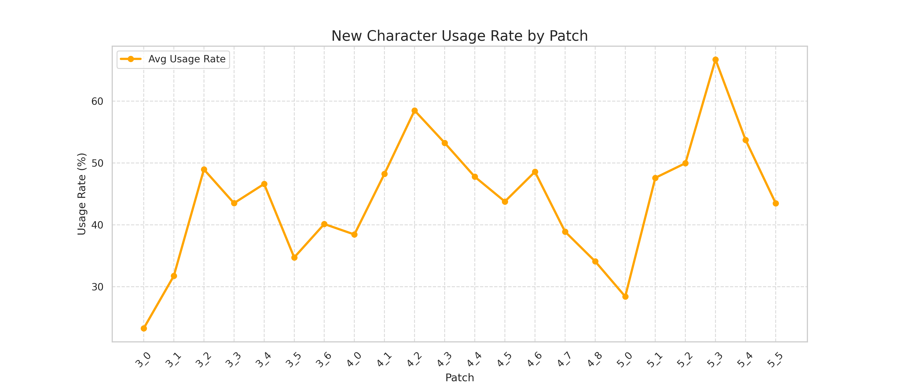
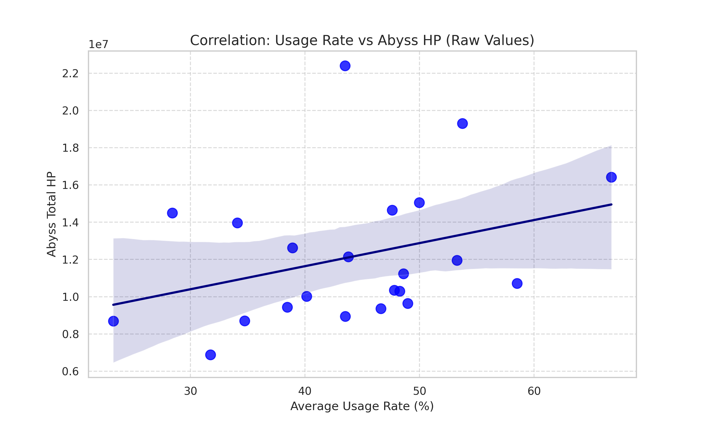
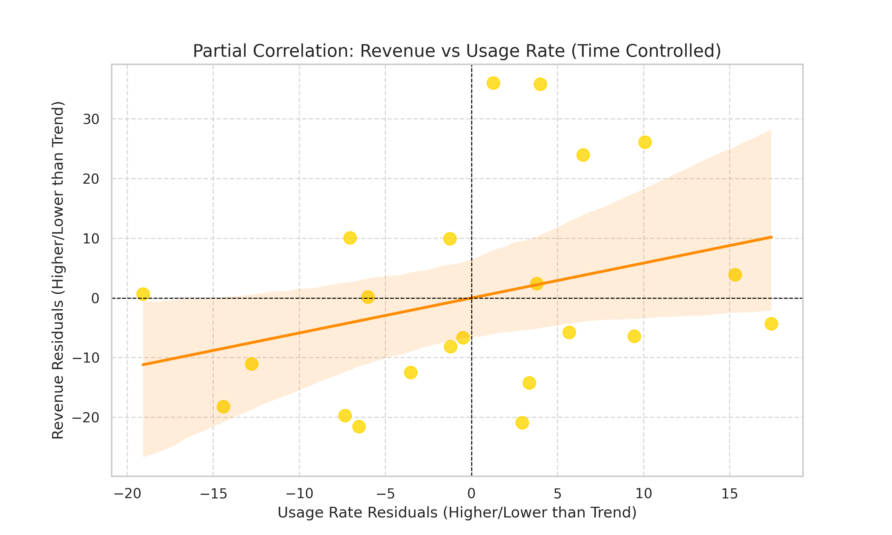
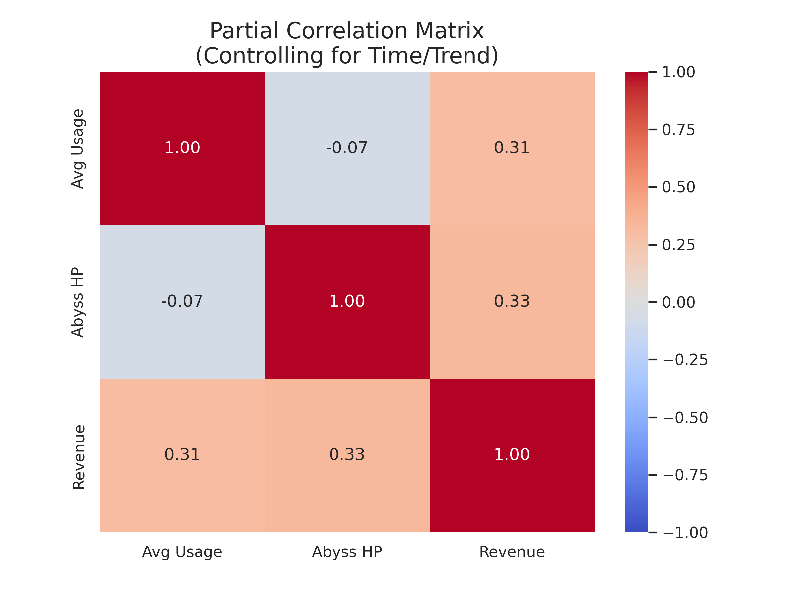

# Project Report

In this project, I will explore Gacha systems within the gaming industry, focusing on how specific developer strategies influence player spending habits.

# Important terminologies used in the report and the Motivation

## Gacha systems

Gacha is a game mechanic that involves players spending in-game currency or real money to receive random virtual items. The term originates from the Japanese word "gachapon," which refers to vending machines that dispense capsule toys. In video games, this translates to a virtual "pull" or "spin" that rewards players with random characters, items, or other in-game assets. A key difference between Gacha and standard "mystery box" systems is the implementation of a safety net system. When players fail to obtain a high-value item, the virtual probability of winning that high-value item increases after a certain number of attempts.

## Genshin Impact

Genshin Impact is an anime-styled action role-playing game that utilizes Gacha mechanics for monetization. The Characters seen in the story of the game are often only purchasable via the Gacha system for a limited time. These characters can be used to complete specific time-sensitive challenges that reward players with game currency.

## Motivation

My interest in this project started from my regular experience playing Genshin Impact. I noticed that completion time of these challenges changes significantly depending on the game's current patch. I realized that I could clear challenges much faster using newly released characters compared to older ones even when the investment level (a term used to refer to the resources and money a player puts into a character) was identical. Upon researching social media, I discovered that many other players experienced similar inconsistencies in their clear times. This observation brought me the question: Is this difficulty shift an intentional design choice by companies to force players to get the newest characters and if so, how does it affect players spending habits?

# Plan

My plan is to analyze 3 datasets which are:

- **Usege Rate** of the newest character in their featured patch and 4 patch after that,
- Abyss **Total HP (hit point) pool** by their respective patch,
- Genshin Impacts **revenue** by the respective patch

By analyzing the usage rate of the current patch and the total HP pool differences between between patches, I want to find the correlation between those to datasets and if the correlation is high to be considered correlated I am going to compare the these 3 datasets to find the correlation between use rate, total HP pool and the revenue return of this correlation to the corporation.

# Data Sources

- Use rate data set is taken from an independent website **“YShelper”** which collects player submitted data of the final floor of the time sensitive challenges. [Dataset available here](https://app.yshelper.com/#/pages/rank/rank)
- The total HP data set is taken from an independent website **“HomDGCat”** which uploads Abyss data from in-game files. [Dataset available here](https://homdgcat.wiki/gi/abyss)
- Genshin Impacts revenue data set is taken from the “AppMagic”. [Dataset available here](https://www.statista.com/statistics/1208573/genshin-impact-player-spending-app/?srsltid=AfmBOoof8XrUut8GmACbrlQlGxYN14597PhmI2-Gtqznn-fPD3GwgoAk)

## Plans on collecting the data 

 - My usage rate data is used in the mentioned website for usage trend analysis of individual characters for 29 patches. I entered the values of the specified characters manually to a dataset. I extracted the data of the characters usage rate after their release and 4 patches after that to show how this new character affected the general usage rate data. To show the effect of the characters, I took the weighted average of this data with the release patch taking 5 heaviness and the fifth patch after release taking 1 heaviness which improves the release patch effect of the newest character. By this weighted average data now I can calculate another weighted average called “generalized ”which calculates how much the new characters are being played by the player base giving the newest character more heaviness.

- My hit point data manually extracted from the mentioned website above and listed as chamber by chamber for floor 12. I added these HP values to find the total HP value of a patch.

- My revenue data is directly scrapped from a line chart that I found in the website mentioned above and extracted by an LLM.        

## Fixing the data 

Before putting these datasets to the exploratory data analysis the numbering of the patch numbers in the HP dataset is changed to the official values and the dates in the revenue dataset is changed to the official patch numbering to find a common ground between datasets. When calculating the  

# Exploratory data Analysis 

Different plotting techniques are used for the HP, usage rate and revenue datasets. Histograms are used for the HP and revenue data and line charts are used for the usage rate data to give a better visualization.

# Hypothesis Testing 

My null hypothesis is the statement that there is no correlation between these 3 variables and these variables are not affecting each other.To calculate the significance of the correlation between the Usage rate and the HP I used Pearson correlation. After finding some correlation between these values I also calculated HP vs. Revenue and Usage rate vs. Revenue but used a partial correlation method to accommodate for the ageing of the game which naturally decreases the revenue (verified by the data analysis). After doing mentioned correlation tests, I find the p values of the given correlations (detaily explained in the Findings section). 

# Findings

## EDA 

The following histogram shows the Abyss total HP with a Trend line. The x-axis is the patch of the information, and the y-axis is the HP value of the current patch in millions.

We can see that there is a clear trend that the total HP value by patch is increasing with nearly every patch.

The following histogram shows the Revenue with a Trend line. The x-axis is the patch of the information, and the y-axis is the Revenue made in the current patch in million USDs.

We can see that there is a clear trend that the revenue decreasing with nearly every patch with some exceptions like 5.2 and 4.5 which is effected by meta defining new characters.

The following histogram shows the new characters usage rate with Trend line. The x-axis is the patch of the information, and the y-axis is usage rate of the newest character in precentage. Because I want to look at the new Chracters effect on the meta I took the weighted average of the 5 patches after the characters release. 

We can not say anyting about this graph because of the unpredictable way of the data and the effect of the story that we do not include for simplicity.

## Hypothesis Testing

The following scattered plot shows the partial correlation residuals between **HP spikes** and **Revenue spikes**. The x-axis is HP residuals, and the y-axis is Revenue residuals both in milions.

We can see that there is a partial correlation between these values which is around 31%.

The following scattered plot shows the partial correlation residuals between **Usage rate** and **Abyss Total HP**. The x-axis is HP residuals, and the y-axis is Revenue residuals.

We can see that there is a partial correlation between these values which is around 33%.

The following scattered plot shows the partial correlation residuals between **Usage rate** spikes and **Revenue spikes**. The x-axis is HP residuals, and the y-axis is Revenue residuals.

We can see that there is a partial correlation between these values which is around 33%.

There is a correlation matrix for better visualization which uses controlled time

After getting Pearson correlation values. We can calculate the p-values of these correlations respectively to find the differances are significant or not.

- Correlation between Abyss HP and Usage Rate is 0.3318. When we calculate the p-value, it aproximates to 0.13137. Because it is bigger than 0.05, We **fail to reject the null hypothesis** but can say that **there is a correlation but the correlation is not significant enough**.
  
- Partial correlation between Revenue and Usage Rate is 0.3106. When we calculate the p-value, it aproximates to 0.17063. Because it is bigger than 0.05, We **fail to reject the null hypothesis** but can say that **there is a correlation but the correlation is not significant enough**.

- Partial correlation between Revenue and Total Abyss HP is 0.3344. When we calculate the p-value, it aproximates to 0.13843. Because it is bigger than 0.05, We **fail to reject the null hypothesis** but can say that **there is a correlation but the correlation is not significant enough**.

The main reason that we can not reject the null hypothesis is when calculating the significance of the character we are not considering any other value than them being the newest character which complicate the predictibility of the usage data. More will be explained in the **Limitations and Future Work** part.  

# Machine Learning

